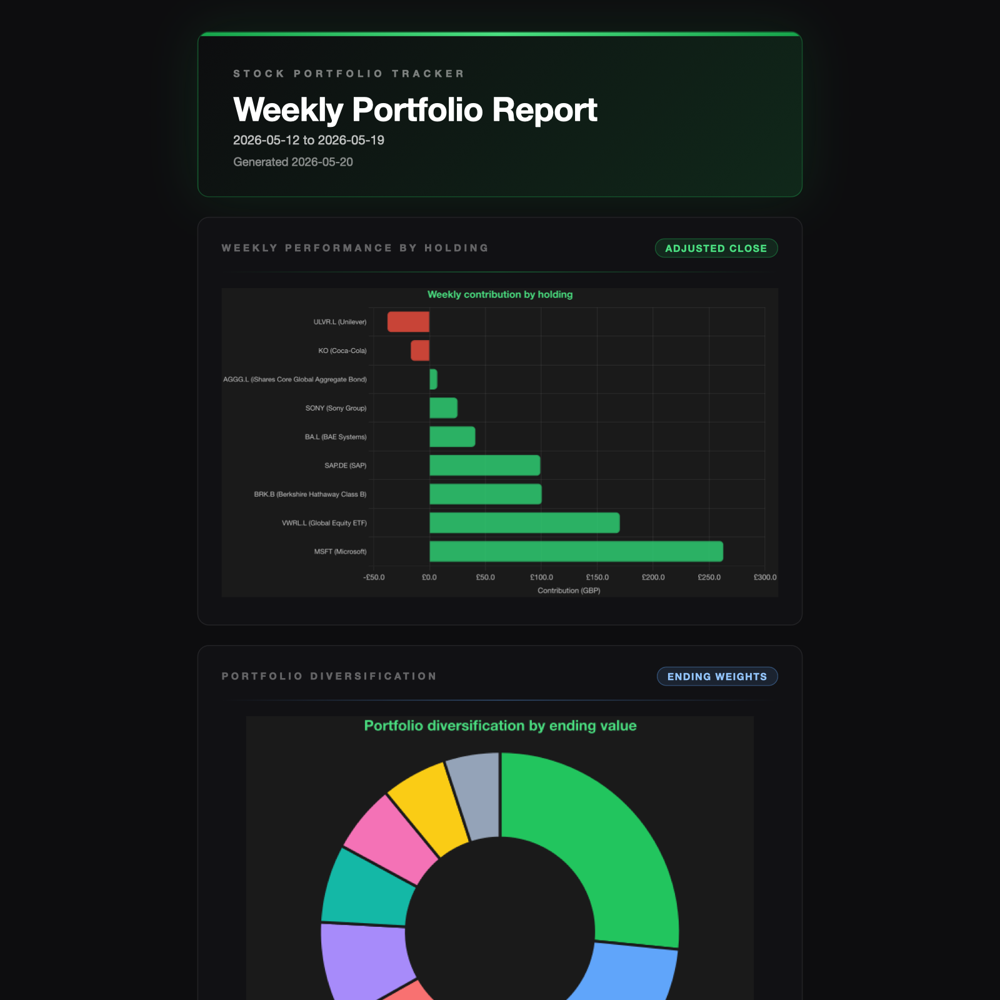

# Stock Portfolio Tracker

An automated weekly email report for your stock portfolio. It reads holdings from a CSV file, fetches adjusted-close market data from `yfin.dev`, normalizes holdings into GBP, compares the portfolio against a benchmark, explains the biggest contributors and detractors, adds external market/news context with an OpenAI agent, and emails the report via Resend.



## Features

- Weekly Trigger.dev automation every Monday at 13:00 UTC
- CSV-based holdings input with `stock name`, `ticker`, and `shares`
- Adjusted-close weekly performance calculations in the configured report currency
- Portfolio return, benchmark comparison, and contribution analysis
- Inline charts for weekly holding contribution and portfolio diversification
- AI-written narrative grounded in computed facts plus external market/news context
- Per-ticker data issues surfaced in the email instead of failing the entire run

## CSV format

Create a `portfolio.csv` file in the repo root or point `PORTFOLIO_CSV_PATH` at another location.

```csv
stock name,ticker,shares
Apple Inc,AAPL,12
Microsoft,MSFT,8
NVIDIA,NVDA,5
```

A sample file is included as `portfolio.example.csv`.

## Environment variables

Copy `.env.example` to `.env` and fill in:

```env
OPENAI_API_KEY=your-openai-api-key
RESEND_API_KEY=your-resend-api-key
RECIPIENT_EMAIL=you@example.com
FROM_EMAIL=Portfolio Reports <reports@example.com>

PORTFOLIO_CSV_PATH=./portfolio.csv
BENCHMARK_TICKER=SPY
BENCHMARK_NAME=SPDR S&P 500 ETF Trust
REPORT_CURRENCY=GBP

TRIGGER_SECRET_KEY=your-trigger-secret-key
TRIGGER_PROJECT_REF=proj_xxxxxxxxxx
```

`yfin.dev` supports anonymous public access, so no signup is required. But there are rate limits if you're planning to run the report frequently or with a large portfolio. Contact `yfin.dev` to request higher limits if needed.

## Installation

1. Install Node dependencies:

   ```bash
   npm install
   ```

2. Create your portfolio CSV:

   ```bash
   cp portfolio.example.csv portfolio.csv
   ```

3. Fill in your environment variables:

   ```bash
   cp .env.example .env
   ```

## Running

### Local development

```bash
npm run dev
```

Trigger the `portfolio-weekly-report` task from the Trigger.dev dashboard.

### Deploy

```bash
npm run deploy
```

### Type-check

```bash
npm run typecheck
```

## How it works

1. Trigger.dev starts the weekly task on Monday.
2. TypeScript reads the CSV holdings file and downloads recent adjusted-close prices from `yfin.dev`.
3. Quotes are normalized into `REPORT_CURRENCY`, and LSE pence quotes (`GBp`) are first converted into pounds before any FX conversion.
4. The app identifies the most recent completed benchmark trading day and the comparable prior-week trading day.
5. It computes holding-level returns, beginning-of-week-weighted contributions, portfolio totals, and benchmark-relative performance.
6. TypeScript renders a weekly contribution chart and a diversification chart, then fills an HTML email template.
7. An OpenAI agent researches external market and company context, but uses the computed metrics as the numeric source of truth.
8. Resend delivers the final email with both charts embedded inline.

## Documentation examples

The `docs/` directory includes static preview assets for the current email layout:

- `docs/example.html` — standalone sample email preview
- `docs/example.png` — rendered preview image of the sample email
- `docs/chart-example.png` — weekly holding contribution chart example
- `docs/diversification-chart-example.png` — portfolio diversification chart example

## Notes

- Weekly returns are based on `yfin.dev` adjusted close data and the nearest completed trading days one week apart.
- Holdings that are missing price data for the report window are excluded from calculations and listed in a "Data issues" section.
- The benchmark defaults to `SPY` but is configurable.
- `yfin.dev` offers anonymous public access and optional contact-based higher limits.
- Some exchange-traded funds need an exchange-qualified Yahoo symbol. The built-in data-source aliases resolve `VUSA` and `VUKE` via their London listings (`VUSA.L` and `VUKE.L`).
- Report values are normalized to `REPORT_CURRENCY`. Currency conversions use the free `frankfurter.app` API, and pence-denominated London quotes are divided by 100 before FX conversion.
- `FROM_EMAIL` must be a sender address/domain that is verified in Resend.
- The report is for informational purposes only and is not investment advice.
